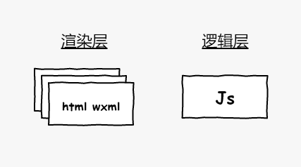

# 用户端个性化配置方案思路整理

## 背景
随着用户数量逐渐增加，出现了一些差异化需求，从技术实现上提前进行升级改造的通用方案整理，涉及到`微信小程序用户端`、`H5用户端`。作为技术开发团队，“友好的产品体验” 和 “稳定的系统服务” 是最基本的执行原则，因此还需要考虑差异化处理后，加载、渲染性能和感知体验几大维度的优化。

已知的差异化需求点如下:
- 商户品牌标识差异;
- 品牌色彩差异；
- 入口页面各模块的显示、隐藏、排序；
- 产品详情各模块的显示、隐藏、排序；
- 不同设计风格的皮肤选项

## 了解前端渲染结构
- 视图层：也就是view部分，负责启用html、wxml来渲染不同的页面；
- 逻辑层：执行JS代码，可以控制视图层的交互及显示逻辑；

